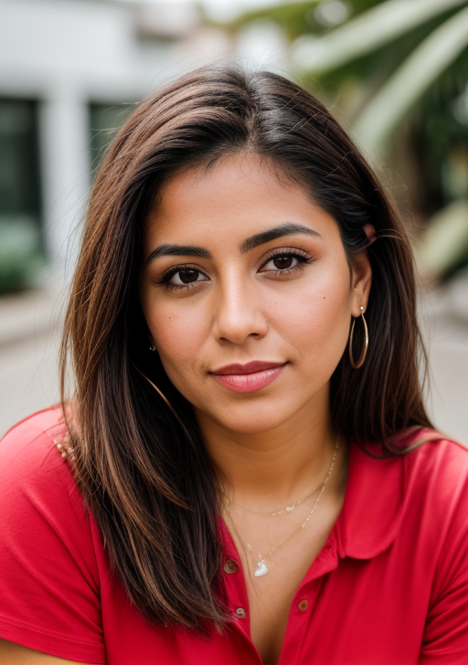
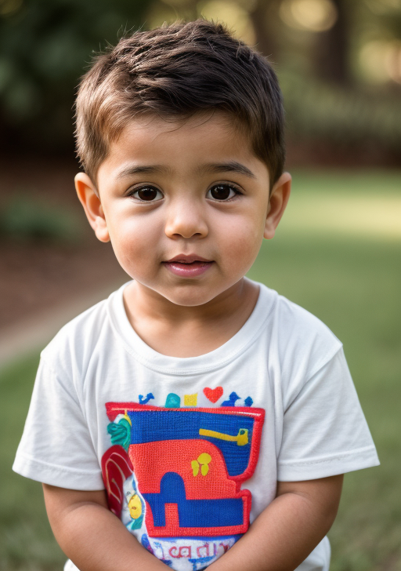
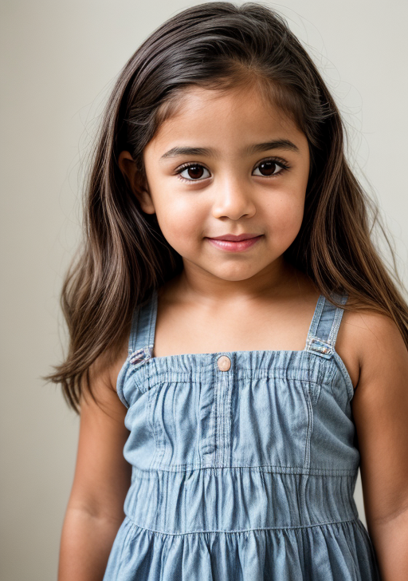

# baby-pics Cog model

This is an implementation of a custom model: AI baby picture generator as a Cog model. [Cog packages machine learning models as standard containers.](https://github.com/replicate/cog)

First, download the pre-trained weights:

    cog build -t baby-pics

Then, you can run predictions:

    cog predict -i image=@mom1.jpg -i image2=@dad1.jpg

## Example Input:

Parent 1:

Parent 2:

AI Generated Baby Pic - Boy:

AI Generated Baby Pic - Girl:

